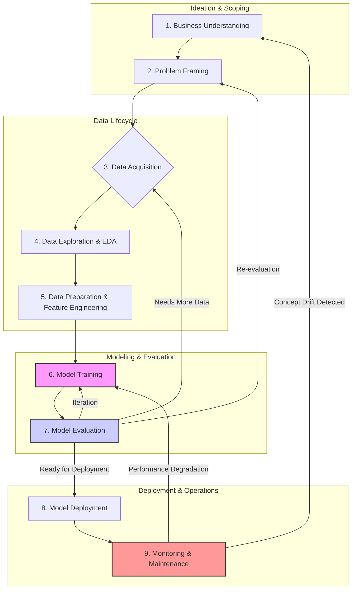

# Part 4: Reflection & Workflow Diagram

This section reflects on the practical challenges inherent in the AI development lifecycle and provides a detailed visual and descriptive guide to the workflow itself.

---

## Reflection (5 points)

### 1. What was the most challenging part of the workflow? Why?

The most challenging part of the AI development workflow is consistently the **Data Preparation stage**, which encompasses collection, cleaning, and preprocessing. While modeling often gets the spotlight, it is this foundational stage where the majority of time is spent and where projects are most likely to fail.

**Key Challenges:**

- **Data Scarcity and Quality:** Real-world data is rarely perfect. For the "Patient Readmission" case study, EHR data can be notoriously messy, containing missing lab values, inconsistent formatting across departments, and subjective notes that are difficult to parse. Simply acquiring a clean, usable dataset can take months of effort.

- **Hidden Biases:** Data reflects the world it was collected from, including societal biases. The data might underrepresent certain demographic groups or contain historical biases in diagnoses, which can lead to a model that perpetuates or even amplifies healthcare disparities. Identifying and mitigating these biases is a complex ethical and technical challenge that goes beyond simple imputation or normalization.

- **Domain Knowledge Requirement:** Effective feature engineering—the process of creating predictive variables from raw data—is impossible without deep domain expertise. For patient readmission, a data scientist must work closely with clinicians to understand which combinations of lab results, medications, and diagnoses are truly meaningful.

---

### 2. How would you improve your approach with more time/resources?

With more time and resources, the approach could be significantly enhanced in two key areas:

#### **Advanced Feature Engineering and Prototyping**
- **More Granular Data:** Integrate more diverse data sources such as wearable devices, demographic patterns, or sentiment data from patient feedback systems.
- **Automated Feature Engineering (AutoML):** Use AutoML tools to generate and test hundreds or even thousands of potential features to uncover hidden relationships.

#### **Robust Model Validation and Explainability (XAI)**
- **Rigorous Testing:** Implement cross-validation on different population segments (e.g., by age group or hospital department) to ensure fairness and robustness.
- **Explainable AI (XAI):** Apply frameworks like **SHAP** or **LIME** so clinicians can interpret predictions (e.g., “High risk due to A1C levels and prior CHF history”).

---

## Diagram & Explanation (5 points)

Below is a more detailed flowchart of the **AI Development Workflow**, emphasizing its **cyclical and iterative nature** rather than a linear pipeline.

---

### **Explanation of Workflow Stages**

**1. Business Understanding**
- Understand project objectives and stakeholder needs.
- Define success metrics (e.g., reduce 30-day readmissions by 15%).

**2. Problem Framing**
- Translate business goals into a machine learning task.
- Decide target variable and output type.

**3. Data Acquisition**
- Identify and collect data sources (EHR, sensors, third-party).
- Ensure compliance (HIPAA, GDPR).

**4. Data Exploration (EDA)**
- Visualize data trends, detect anomalies, and summarize key insights.

**5. Data Preparation & Feature Engineering**
- Handle missing values, normalize data, encode categorical features.

**6. Model Training**
- Select model type (e.g., Random Forest, Neural Network).
- Split dataset into train/test/validation.

**7. Model Evaluation**
- Assess model performance using metrics (precision, recall, AUC).
- Conduct subgroup fairness analysis.

**8. Model Deployment**
- Package model into Docker/Flask API and integrate with production systems.

**9. Monitoring & Maintenance**
- Track performance and detect concept drift.
- Retrain or reframe the model as needed.
